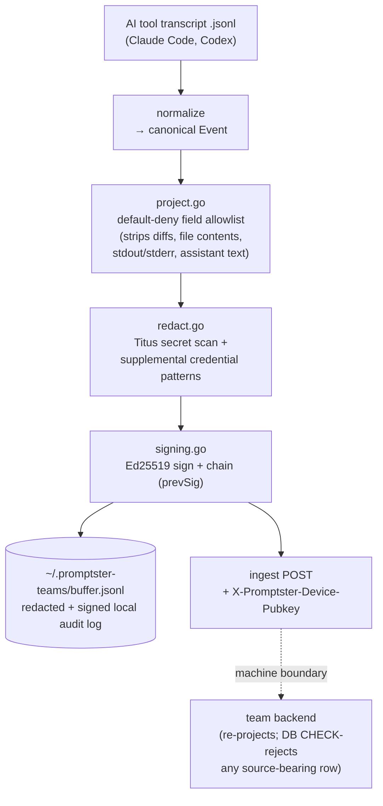

# promptster-teams-cli

[](https://github.com/pa-arth/promptster-teams-cli/actions/workflows/ci.yml)
[](https://github.com/pa-arth/promptster-teams-cli/actions/workflows/codeql.yml)
[](https://www.npmjs.com/package/@promptster/teams-cli)
[](LICENSE)

On-device capture of AI-assisted coding for internal engineering teams.

`promptster-teams` tails the transcript files your AI coding tools already write
to disk (Claude Code, Codex), redacts secrets **on your machine**, signs each
event into a tamper-evident chain, and streams the result to your team's
Promptster backend so managers and engineers get live, accurate dashboards of
how AI is actually being used.

It is intentionally small and **fully auditable** — this repository is public so
your security team can read every line that decides what leaves a developer's
machine. There is no hidden telemetry, no keystroke logging, and no "integrity"
or anti-cheat instrumentation. (Promptster's hiring product is a separate, private
codebase; none of its assessment, honeypot, or behavioral-analysis logic exists
here. CI fails the build if any of it is reintroduced.)

## Architecture / data flow

Everything below the dashed line happens **on the developer's machine**. Source
content is dropped by the field allowlist *before* an event is ever buffered,
signed, or sent — it never crosses the machine boundary.



## What it captures

Read straight from the AI tool's own transcript `.jsonl`:

- Prompts you send
- Tool-call *metadata*: file paths + line counts for edits, command invocations
  (with inline code bodies masked) + exit codes — never diffs, file contents, or
  command output
- Per-request token usage and the exact model, for cost estimation
- Timestamps, so the timeline reflects when work happened

## What it does NOT capture

- **Source code — it never leaves your machine.** Before an event is buffered,
  signed, or sent, a default-deny field allowlist (`project.go`) strips diffs,
  file contents, command stdout/stderr, and assistant response text on-device.
  The backend applies the same projection again at its write boundary and its
  database rejects source-bearing rows outright (CHECK constraints) — but with
  this CLI the source content is never even transmitted.
- Assistant response *text* (only its token usage + model are kept)
- Keystrokes, clipboard, screen, webcam/microphone
- Any file you didn't open through the AI tool
- Secrets and credentials — these are **redacted on-device before anything is
  sent** (see below)
- Behavioral signals: no typing-cadence, no paste detection, no authorship
  scoring. Capture is *content*, not surveillance of the developer.
- Your email or any personal identity. Events are stamped only with an
  **anonymous per-device hash** and your team key; the CLI never collects or
  sends your email. Mapping a device to a person is done on the backend, from
  the key — so nothing in this on-device path needs to know who you are.

## Presence heartbeat

While `watch` is running it emits a small **presence** event on start and every
few minutes — *even when you are idle and nothing is being captured*. It carries
only device + environment metadata (the anonymous device hash, the CLI version,
OS/arch, and which tools are being watched) and **zero transcript content**.

Its only purpose is to let your team tell an *installed-but-idle* seat apart
from one where the CLI was *never installed* — e.g. for seat-utilization
reporting. It is not a tracker: it identifies a machine, never a person, and a
CI test (`presence_test.go`) fails the build if a presence event ever grows a
field that could carry captured content.

## Redaction (on-device, before transmission)

Every captured line passes through three layers locally, before it is
buffered, signed, or sent:

1. **Source exclusion** (`project.go`) — a default-deny, per-kind field
   allowlist that strips diffs, file contents, command output, and assistant
   text, and masks inline code bodies in kept command strings
   (`python -c '…'` → `python -c '<inline-code-redacted>'`).
2. **Titus** (Praetorian's entropy-aware scanner, ~490 provider rules: AWS,
   GitHub, Anthropic/OpenAI, Slack, JWT, PEM private keys, …). Why Titus and
   not gitleaks: see [docs/redaction-titus-vs-gitleaks.md](docs/redaction-titus-vs-gitleaks.md).
3. **Supplemental patterns** for `KEY=value` assignments, bearer headers, and
   other generic credential shapes.

If you need to verify exactly what would leave a machine, the local buffer at
`~/.promptster-teams/buffer.jsonl` holds the **already-redacted, already-signed**
event stream.

## Tamper-evident signing

On first run the CLI generates a per-device Ed25519 keypair, storing only the
private seed at `~/.promptster-teams/session.key` (mode 0600) — it never leaves
the machine. Every event is signed and chained to the previous event's
signature (`prevSig`). The **public** verifying key is sent with each ingest
request (`X-Promptster-Device-Pubkey`) so the backend can confirm the stream
wasn't altered in transit; the backend pins the first key it sees per device.

## Threat model

What this tool is designed to guarantee, and where its trust boundaries sit.

**Trust boundaries.** The developer's machine is trusted; everything leaving it
is not. The redaction + allowlist pipeline runs entirely on-device, so the
guarantee "source never leaves the machine" does not depend on trusting the
network or the backend.

- **A malicious or compromised backend** can see the metadata this CLI chooses
  to send (redacted prompts, tool-call metadata, token counts, the anonymous
  device hash, the team key). It **cannot** obtain source code, diffs, file
  contents, command output, or assistant response text, because those are
  dropped locally before transmission — there is nothing on the wire to steal.
  It cannot deanonymize a device to a person from the CLI's payload alone (the
  CLI never sends an email or identity).
- **A network attacker (MITM)** sees only TLS traffic. Tampering is detectable:
  each event is Ed25519-signed and chained (`prevSig`), and the backend pins the
  first device pubkey it sees.
- **Local device compromise is out of scope.** An attacker who already has read
  access to the user's home directory can read the buffer and the `0600` key
  seed — the CLI defends the *transmission* boundary, not a fully compromised
  host.

**Fail behavior — fail-open for availability, fail-closed for content.** The
field allowlist (`project.go`) is default-deny and always runs, so a
kept-by-mistake source field is impossible by construction. The secret scanner
(`redact.go`) layers on top: if the Titus engine fails to initialize, capture
continues on the supplemental credential-pattern layer rather than blocking the
developer — availability is preserved, and the source-exclusion guarantee
(the fail-closed part) is unaffected because it lives in the always-on
allowlist, not in Titus.

**Verifying claims yourself.** The local buffer at
`~/.promptster-teams/buffer.jsonl` is the exact, already-redacted, already-signed
stream — inspect it to see precisely what would leave the machine. To report a
weakness in any of this, see [SECURITY.md](SECURITY.md).

## Install

```sh
npm install -g @promptster/teams-cli   # default
```

The npm package is published with **build provenance** (SLSA attestation) —
verify it with `npm audit signatures`.

Or install the raw binary:

```sh
curl -fsSL https://raw.githubusercontent.com/pa-arth/promptster-teams-cli/main/install.sh | sh
```

The installer downloads `SHA256SUMS` from the release and **verifies the binary
against it before making it executable** — a checksum mismatch aborts the
install. Every release ships `SHA256SUMS` alongside the binaries.

## Usage

Your manager mints you a **developer key** (`PSE-XXXX-XXXX`) in the Promptster
dashboard. Paste it once with `login` — capture starts in the background
automatically — then arm `autostart` so it survives reboots:

```sh
promptster-teams login             # paste your PSE-XXXX-XXXX key — capture starts automatically
promptster-teams autostart enable  # keep capturing across reboots (starts at login)
promptster-teams status            # confirm it's running
```

The key identifies your sessions to your team and nothing else; it is the only
identity stamped on captured events. `login` stores it at
`~/.promptster-teams/credentials` (mode `0600`).

`login` and `start` run capture as a detached background process — but a plain
background process **does not survive a reboot**. `autostart enable` installs a
per-OS login service (launchd on macOS, `systemd --user` on Linux, Task
Scheduler on Windows) that brings capture back after every restart; `autostart
disable` removes it and `autostart status` shows whether it's armed.

Other commands: `watch` runs capture in the foreground (Ctrl-C to stop) for
debugging, `stop` halts background capture, and `doctor` checks your key, ingest
reachability, and transcript dirs.

### Configuration

The developer key is resolved with this precedence: **`--key` flag → `PROMPTSTER_TEAMS_TOKEN` env → stored credentials file** (written by `login`). The ingest URL resolves the same way, defaulting to the hosted backend.

| Variable | Purpose |
|---|---|
| `PROMPTSTER_TEAMS_TOKEN` | Your developer key (`PSE-XXXX-XXXX`). Usually set via `login` instead. |
| `PROMPTSTER_TEAMS_API_URL` | Ingest base URL (default: hosted). Override for a self-hosted backend. |
| `PROMPTSTER_TEAMS_WATCH_DIR` | Directory whose transcripts to capture (default: cwd) |
| `PROMPTSTER_TEAMS_INGEST_PATH` | Override the ingest path (default `/v1/teams/ingest`) |

`watch` and `login` also accept `--key PSE-…` and `--api-url <url>` flags.

## Build

```sh
make build      # -> bin/promptster-teams
make test
make release    # cross-compile linux/darwin × amd64/arm64 -> dist/
```

CI runs cross-platform build/test, the race detector, `gofmt`/`staticcheck`
lint, `gosec` (SAST) and `govulncheck` (dependency + stdlib CVEs, published to
the GitHub Security tab), CodeQL, and a gitleaks self-scan. See
[CONTRIBUTING.md](CONTRIBUTING.md) to run the same checks locally, and
[SECURITY.md](SECURITY.md) to report a vulnerability.

## Status

This is the initial capture-only release: foreground `watch`, configurable
ingest, on-device redaction, and signed streaming. Persistent background
running, org → team → developer enrollment, customer-configurable redaction
rules, a metadata-only fidelity tier, and a "preview exactly what would be sent"
dry-run are on the roadmap.
